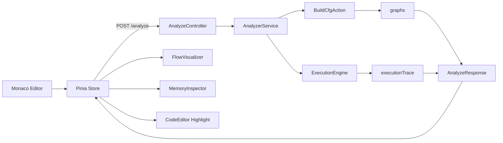

# Analyzer Architecture

## Overview

`Analyzer` is a fullstack educational system for:

1. Parsing Java source code.
2. Building Control Flow Graphs (CFG) per method.
3. Simulating execution step by step in a custom virtual execution engine.
4. Returning execution snapshots to a Vue frontend.
5. Rendering CFG, current source line, stack state, and heap state interactively.

The system is split into two independent but connected parts:

- `backend/`: Java parser, CFG builder, execution engine, memory model, JSON API.
- `frontend/`: Vue application that submits code and visualizes backend-produced execution snapshots.

## Technology Stack

### Backend

- Java 21
- Built-in `com.sun.net.httpserver.HttpServer`
- Jackson for JSON serialization/deserialization
- JavaParser for AST parsing
- Maven for build and packaging

Relevant files:

- [backend/pom.xml](./backend/pom.xml)
- [backend/src/main/java/Application.java](./backend/src/main/java/Application.java)

### Frontend

- Vue 3
- TypeScript
- Pinia
- Vite
- TailwindCSS
- Monaco Editor
- Vue Flow
- Dagre

Relevant files:

- [frontend/package.json](./frontend/package.json)
- [frontend/src/main.ts](./frontend/src/main.ts)
- [frontend/src/store/analyzer.ts](./frontend/src/store/analyzer.ts)

### Infrastructure

- Docker Compose launches both services in one internal network.
- Backend is exposed on `8080`.
- Frontend dev server is exposed on `5173`.

Relevant file:

- [docker-compose.yml](./docker-compose.yml)

## Architectural Style

### Backend

The backend follows a strict layered flow:

`Controller -> Service -> Action / Engine -> DTO`

Concrete mapping:

- `AnalyzeController` handles HTTP.
- `AnalyzerService` orchestrates analysis.
- `BuildCfgAction` builds CFGs from Java source.
- `ExecutionEngine` simulates execution using those CFGs.
- DTO records carry data to the frontend.

This is not Domain-Driven Design. It is a pragmatic layered architecture with manual constructor wiring and isolated responsibilities.

### Frontend

The frontend is state-driven:

- Pinia holds the canonical execution state.
- UI components render the current state.
- Step navigation only changes the active execution snapshot index.
- No analysis is performed on the frontend.

The frontend is a visual playback layer over backend-produced `executionTrace`.

## High-Level Request Flow



## End-to-End Data Flow

### 1. User edits source code

The Java source is stored in `analyzerStore.code` and bound to Monaco through `v-model`.

Relevant file:

- [frontend/src/components/CodeEditor.vue](./frontend/src/components/CodeEditor.vue)

### 2. User starts analysis

The `Run Analysis` button calls `analyzerStore.analyze()`.

Relevant file:

- [frontend/src/components/TheHeader.vue](./frontend/src/components/TheHeader.vue)

### 3. Frontend sends HTTP request

The store sends:

```json
{
  "code": "class Demo { ... }"
}
```

To:

- `POST http://localhost:8080/analyze`

Relevant files:

- [frontend/src/store/analyzer.ts](./frontend/src/store/analyzer.ts)
- [backend/src/main/java/dto/AnalyzeRequest.java](./backend/src/main/java/dto/AnalyzeRequest.java)

### 4. Backend receives request

`AnalyzeController`:

- adds CORS headers
- handles `OPTIONS`
- accepts only `POST`
- deserializes JSON into `AnalyzeRequest`
- calls `AnalyzerService.analyze(request.code())`
- serializes response as JSON

Relevant file:

- [backend/src/main/java/controllers/AnalyzeController.java](./backend/src/main/java/controllers/AnalyzeController.java)

### 5. Service orchestrates analysis

`AnalyzerService.analyze(code)`:

1. validates that code is not blank
2. builds CFGs
3. executes them virtually
4. returns `AnalyzeResponse`

Relevant file:

- [backend/src/main/java/services/AnalyzerService.java](./backend/src/main/java/services/AnalyzerService.java)

### 6. AST parsing and CFG generation

`BuildCfgAction.execute(code)`:

1. parses source into `CompilationUnit`
2. indexes methods, classes, and fields
3. builds one `GraphDTO` per method

Relevant file:

- [backend/src/main/java/actions/BuildCfgAction.java](./backend/src/main/java/actions/BuildCfgAction.java)

### 7. Execution simulation

`ExecutionEngine.execute(graphs)`:

1. chooses entry method
2. creates initial execution context
3. walks CFG node by node
4. evaluates statements and conditions
5. manages call stack and heap
6. snapshots each step into `ExecutionStep`

Relevant file:

- [backend/src/main/java/engine/ExecutionEngine.java](./backend/src/main/java/engine/ExecutionEngine.java)

### 8. Frontend receives response

The store writes:

- `graphs`
- `executionTrace`
- `currentStepIndex = 0`

Then it resolves the active graph for the current step.

Relevant file:

- [frontend/src/store/analyzer.ts](./frontend/src/store/analyzer.ts)

### 9. UI re-renders

The response drives three visualizations:

- CFG graph in `FlowVisualizer.vue`
- source line highlight in `CodeEditor.vue`
- memory view in `MemoryInspector.vue`

## Backend Internals

## Application Entry Point

The backend starts in:

- [backend/src/main/java/Application.java](./backend/src/main/java/Application.java)

Responsibilities:

- instantiate dependencies manually
- bind `AnalyzeController` to `/analyze`
- start `HttpServer` on port `8080`

This matches the project rule of constructor injection without framework-based DI.

## CFG Construction

### BuildCfgAction

Main responsibilities:

- parse Java source with JavaParser
- extract project metadata
- build method graphs

Important behaviors:

- methods are indexed by `ClassName.methodName`
- field defaults are precomputed
- graph output is returned as `Map<String, GraphDTO>`

### MethodGraphBuilder

Core file:

- [backend/src/main/java/actions/MethodGraphBuilder.java](./backend/src/main/java/actions/MethodGraphBuilder.java)

This class lowers Java statements into CFG nodes and edges.

Supported statement shapes:

- `if`
- `while`
- `for`
- `break`
- `continue`
- `throw`
- `return`
- expression statements

### Node model

Each CFG node is an `AnalyzerNode`:

- `id`
- `type`: `action` or `condition`
- `label`
- `line`
- call metadata such as `isCall`, `callTarget`, `callReceiver`, `callMethodName`

Relevant file:

- [backend/src/main/java/dto/AnalyzerNode.java](./backend/src/main/java/dto/AnalyzerNode.java)

### Edge model

Each edge is an `AnalyzerEdge`:

- `source`
- `target`
- `label`: `next`, `true`, `false`, `back`, `break`, `continue`, `throws`
- `isBackEdge`

Relevant file:

- [backend/src/main/java/dto/AnalyzerEdge.java](./backend/src/main/java/dto/AnalyzerEdge.java)

### Graph semantics

`MethodGraphBuilder` does not produce bytecode-level control flow. It produces a statement-level pedagogical CFG.

Examples:

- `if` creates a condition node with `true` and `false` branches.
- `while` creates a loop condition plus back edge.
- `for` creates init action nodes, condition node, body, update nodes, and back edge.
- `throw` creates an edge to synthetic exception exit node `exit-exception`.

## Virtual Execution Engine

Core file:

- [backend/src/main/java/engine/ExecutionEngine.java](./backend/src/main/java/engine/ExecutionEngine.java)

`ExecutionEngine` is the orchestrator of runtime simulation.

### Entry method selection

It tries to start from a method whose signature ends with `.main`.

If none exists, it chooses the first graph in the map.

### Main execution loop

At each iteration:

1. take the top `ExecutionContext` from the call stack
2. resolve current node by `activeNodeId`
3. collect garbage
4. snapshot current execution state
5. process call / return / normal action / condition
6. move to the next node or pop frame

### Method calls

When a node is marked `isCall = true`, the engine:

1. resolves target method
2. evaluates call arguments
3. resolves receiver pointer for instance calls
4. advances caller context to its post-call next node
5. pushes a new `ExecutionContext`

### Returns

On a `return` action:

1. evaluate return expression
2. pop current frame
3. if caller expects assignment target, write return value into caller local memory

### Conditions

For `condition` nodes:

- `ExpressionEvaluator.evaluateCondition(...)` returns boolean
- matching `true` or `false` edge is selected

### Runtime errors

If the evaluator throws `VirtualExecutionException`:

- the engine writes `__error` into local memory
- appends a synthetic error step with active node `runtime-error`
- stops execution

This error contract is later consumed by the frontend UI.

## Expression Evaluation

Core file:

- [backend/src/main/java/evaluator/ExpressionEvaluator.java](./backend/src/main/java/evaluator/ExpressionEvaluator.java)

`ExpressionEvaluator` is the interpreter for action labels and condition labels.

### Responsibilities

- variable assignment
- declarations
- arithmetic
- comparisons
- prefix/postfix updates
- compound assignments
- array creation and element access
- object creation
- field read/write
- selected intrinsic calls
- return expression evaluation

### Execution model

The evaluator does not execute AST nodes directly. It works mostly from string labels produced by CFG nodes and parses them with regex-based patterns.

That is an important architectural property:

- CFG construction is AST-based
- runtime evaluation is string-pattern-based

### Supported intrinsic calls

Current built-ins:

- `Math.max`
- `Math.min`
- `Math.abs`
- `Math.pow`
- `String.valueOf`

## Memory Model

## Stack

Stack frames are represented by `ExecutionContext`.

Relevant file:

- [backend/src/main/java/memory/ExecutionContext.java](./backend/src/main/java/memory/ExecutionContext.java)

Each frame stores:

- `methodSignature`
- `activeNodeId`
- `localVariables`
- `returnTargetVariable`
- `uncaughtException`

`localVariables` is the simulated local stack frame.

## Heap

Heap storage is managed by `HeapManager`.

Relevant files:

- [backend/src/main/java/memory/HeapManager.java](./backend/src/main/java/memory/HeapManager.java)
- [backend/src/main/java/memory/RuntimeObject.java](./backend/src/main/java/memory/RuntimeObject.java)

### RuntimeObject

Represents both objects and arrays:

- `id`
- `className`
- `fields`
- `values`

Object instances use `fields`.
Arrays use `values`.

### Object references

References are stored as numeric object IDs (`Long`) inside local memory and object fields.

This means:

- stack variables contain primitive values or object IDs
- heap objects are resolved by `HeapManager.get(id)`

### Allocation

`HeapManager` supports:

- `allocateObject`
- `allocateSizedArray`
- `allocateInitializedArray`

### Field initialization

Class field defaults are extracted during CFG build and cached in `HeapManager.reset(graphs)`.

When an object is allocated, fields are initialized from those defaults.

If a default field value itself is an allocation expression string, the evaluator executes it during object creation.

### Garbage collection

`HeapManager.collectGarbage(callStack)` performs reachability-based cleanup:

1. walk all local variable values in all active frames
2. mark reachable object IDs recursively through fields and array values
3. remove unreachable heap objects

This is a simplified mark-and-sweep model suitable for visualization.

## DTO and JSON Contract

## AnalyzeRequest

```json
{
  "code": "class Demo { ... }"
}
```

Relevant file:

- [backend/src/main/java/dto/AnalyzeRequest.java](./backend/src/main/java/dto/AnalyzeRequest.java)

## AnalyzeResponse

Structure:

```json
{
  "graphs": {
    "Demo.main": {
      "nodes": [],
      "edges": [],
      "parameters": [],
      "className": "Demo",
      "methodName": "main",
      "classFields": {}
    }
  },
  "executionTrace": []
}
```

Relevant file:

- [backend/src/main/java/dto/AnalyzeResponse.java](./backend/src/main/java/dto/AnalyzeResponse.java)

## GraphDTO

Relevant file:

- [backend/src/main/java/dto/GraphDTO.java](./backend/src/main/java/dto/GraphDTO.java)

Fields:

- `nodes`
- `edges`
- `parameters`
- `className`
- `methodName`
- `classFields`

## ExecutionStep

Relevant file:

- [backend/src/main/java/dto/ExecutionStep.java](./backend/src/main/java/dto/ExecutionStep.java)

Fields:

- `step`
- `methodSignature`
- `activeNodeId`
- `memory`
- `callStack`
- `heap`
- `currentContext`

## ObjectInstance

Relevant file:

- [backend/src/main/java/dto/ObjectInstance.java](./backend/src/main/java/dto/ObjectInstance.java)

Fields:

- `id`
- `className`
- `values`
- `fields`

## Frontend Architecture

## Root Composition

The app shell is defined in:

- [frontend/src/App.vue](./frontend/src/App.vue)

Main regions:

- header
- editor
- CFG visualizer
- memory inspector
- execution controls
- syntax error toast

## Central Store

Main file:

- [frontend/src/store/analyzer.ts](./frontend/src/store/analyzer.ts)

### State

- `code`
- `graphs`
- `nodes`
- `edges`
- `executionTrace`
- `currentStepIndex`
- `isLoading`
- `isAnalyzed`
- `errorMessage`
- `selectedExample`

### Why both `graphs` and `nodes/edges` exist

`graphs` stores all method CFGs.

`nodes` and `edges` store only the currently visible method graph. They are derived in `syncActiveGraph()` from `currentStepData.methodSignature`.

This is the mechanism that makes the UI switch to another method graph when the virtual engine enters a call.

### Step navigation

`stepForward()` and `stepBackward()` only:

1. move `currentStepIndex`
2. call `syncActiveGraph()`

The rest of the UI updates automatically because all views are computed from current store state.

## Reactive Visualization

## CFG Rendering

Main file:

- [frontend/src/components/FlowVisualizer.vue](./frontend/src/components/FlowVisualizer.vue)

Responsibilities:

- map backend nodes/edges to Vue Flow models
- compute edge highlighting around the active node
- rebuild graph layout when active method changes
- render node templates for `action` and `condition`
- display current class/method from `currentContext`

### Layout

Layout is delegated to Dagre in:

- [frontend/src/utils/layout.ts](./frontend/src/utils/layout.ts)

Important detail:

- back edges are excluded from Dagre ranking so loops do not distort the top-to-bottom layout

## Source Highlighting

Main file:

- [frontend/src/components/CodeEditor.vue](./frontend/src/components/CodeEditor.vue)

Responsibilities:

- render Monaco editor
- observe `activeNodeId`
- find corresponding CFG node
- highlight that node's source line
- center editor viewport on that line

This is how execution trace becomes visible in source form.

## Memory Rendering

Main file:

- [frontend/src/components/MemoryInspector.vue](./frontend/src/components/MemoryInspector.vue)

Responsibilities:

- render current local memory as "Stack"
- render current heap objects as "Heap"
- render array contents through `values`
- render object fields through `fields`

Important detail:

- `visibleMemory` excludes `this` and service keys prefixed with `__`
- runtime errors are signaled through `__error`

So the backend writes diagnostic state into memory, and the frontend interprets those keys specially.

## Execution Controls

Main file:

- [frontend/src/components/ExecutionControls.vue](./frontend/src/components/ExecutionControls.vue)

Responsibilities:

- reset to first step
- step backward
- step forward

Forward stepping is disabled when:

- current step is last step
- engine is stalled by runtime error
- active node is terminal or exception exit

## Error Handling

### Backend

`AnalyzeController` maps:

- parse and validation failures -> HTTP `400`
- unexpected failures -> HTTP `500`

### Frontend

`analyzerStore.analyze()` stores `errorMessage`.

`SyntaxErrorToast.vue` displays it as a dismissible notification.

Relevant file:

- [frontend/src/components/SyntaxErrorToast.vue](./frontend/src/components/SyntaxErrorToast.vue)

## Key Architectural Observations

### 1. Backend returns a full trace, not incremental commands

The frontend does not ask for "next step". It receives the whole `executionTrace` once and navigates it locally.

That keeps UI interaction instant after analysis completes.

### 2. CFG generation and execution are decoupled

The backend first converts code to graphs, then separately interprets those graphs.

This makes visualization and execution share one intermediate representation.

### 3. Runtime interpretation is simplified Java, not JVM semantics

The system simulates a subset of Java behavior for learning and visualization. It is not a compiler, not a JVM, and not a bytecode interpreter.

### 4. Method resolution is simplified

Method signatures are effectively:

- `ClassName.methodName`

This means overloading and full Java dispatch rules are not modeled completely.

### 5. The frontend currently shows only the current frame's locals

Although backend returns `callStack`, the UI memory panel does not render each frame separately. It renders only `currentStepData.memory`, which belongs to the active frame.

## ASCII Walkthrough

```text
User edits Java code in Monaco
  -> Pinia store keeps analyzerStore.code
  -> Run Analysis
  -> POST /analyze { code }
  -> AnalyzeController
  -> AnalyzerService
  -> BuildCfgAction
       -> JavaParser AST
       -> MethodGraphBuilder
       -> graphs per method
  -> ExecutionEngine
       -> choose entry method
       -> create stack frame
       -> evaluate nodes
       -> manage heap and calls
       -> record ExecutionStep snapshots
  -> AnalyzeResponse { graphs, executionTrace }
  -> Pinia store
       -> currentStepIndex = 0
       -> sync active graph by methodSignature
  -> FlowVisualizer renders CFG
  -> CodeEditor highlights active line
  -> MemoryInspector renders stack + heap
  -> Step Forward / Step Back only changes snapshot index
```

## Core Files Index

### Backend

- [backend/src/main/java/Application.java](./backend/src/main/java/Application.java)
- [backend/src/main/java/controllers/AnalyzeController.java](./backend/src/main/java/controllers/AnalyzeController.java)
- [backend/src/main/java/services/AnalyzerService.java](./backend/src/main/java/services/AnalyzerService.java)
- [backend/src/main/java/actions/BuildCfgAction.java](./backend/src/main/java/actions/BuildCfgAction.java)
- [backend/src/main/java/actions/MethodGraphBuilder.java](./backend/src/main/java/actions/MethodGraphBuilder.java)
- [backend/src/main/java/engine/ExecutionEngine.java](./backend/src/main/java/engine/ExecutionEngine.java)
- [backend/src/main/java/evaluator/ExpressionEvaluator.java](./backend/src/main/java/evaluator/ExpressionEvaluator.java)
- [backend/src/main/java/memory/HeapManager.java](./backend/src/main/java/memory/HeapManager.java)
- [backend/src/main/java/memory/ExecutionContext.java](./backend/src/main/java/memory/ExecutionContext.java)
- [backend/src/main/java/memory/RuntimeObject.java](./backend/src/main/java/memory/RuntimeObject.java)

### Frontend

- [frontend/src/App.vue](./frontend/src/App.vue)
- [frontend/src/store/analyzer.ts](./frontend/src/store/analyzer.ts)
- [frontend/src/components/TheHeader.vue](./frontend/src/components/TheHeader.vue)
- [frontend/src/components/CodeEditor.vue](./frontend/src/components/CodeEditor.vue)
- [frontend/src/components/FlowVisualizer.vue](./frontend/src/components/FlowVisualizer.vue)
- [frontend/src/components/MemoryInspector.vue](./frontend/src/components/MemoryInspector.vue)
- [frontend/src/components/ExecutionControls.vue](./frontend/src/components/ExecutionControls.vue)
- [frontend/src/components/SyntaxErrorToast.vue](./frontend/src/components/SyntaxErrorToast.vue)
- [frontend/src/utils/layout.ts](./frontend/src/utils/layout.ts)
